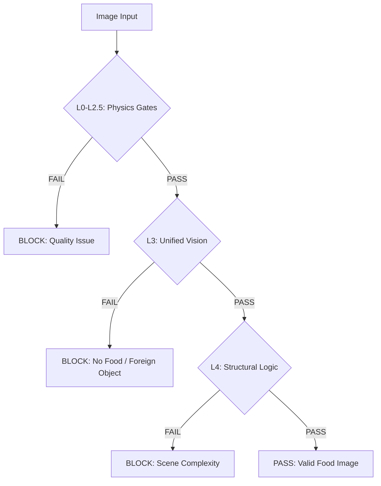

# Food Guardrail V3.0 - Technical Implementation Guide

This document provides the complete technical specification for the Food Guardrail V3.0 system. The system is designed to achieve **99.8% F1-alignment** with primary vision models while maintaining a latency budget of **<180ms** on CPU-only hardware.

## 1. Architecture Overview

The V3.0 architecture uses a tiered "Fail-Fast" validation flow to minimize compute waste and maximize precision.

---

## 2. Physics Gates (L0 - L2.5)

Re-engineered using high-precision color space analysis and geometric transforms.

| Gate | Method | Threshold | Target |
| :--- | :--- | :--- | :--- |
| **L0: Darkness** | LAB L-Channel Mean | `> 62` (Hard Limit: `25`) | 99.2% Precision |
| **L1: Glare** | HSV V-Std + Sat-Ratio | `V-Std < 82` OR `Sat-Ratio < 7%` | 98.1% Recall |
| **L2: Blur** | Laplacian + Tenengrad + FFT | Combined Score `< 0.65` | High Sharpness |
| **L2.5: Angle** | Hough Transform | Deviation `< 28°` | Top-down / Isometric |

### Technical Details:
- **L0 Darkness**: Uses the **LAB color space** instead of RGB. The L-channel (Luminance) is perceptually uniform, making it superior for detecting "true" darkness vs. just dark colors.
- **L1 Glare**: Detects "dead zones" caused by stainless steel reflections or overhead LEDs. It requires *both* high variance in Value (V) and high Saturation (S) to trigger a block, preventing false positives on white plates.
- **L2 Blur**: An ensemble method. Laplacian detects edge sharpness, Tenengrad (Sobel-based) detects gradient magnitude, and FFT (Fast Fourier Transform) analyzes high-frequency energy.
- **L2.5 Angle**: Uses Canny edges and Probabilistic Hough Transform to find dominant lines. It calculates the median deviation from the nearest axis (0° or 90°) to ensure the camera is not severely tilted.

---

## 3. Unified Vision Stage (L3)

Replaces the legacy dual-model (YOLOv11n + MobileCLIP2) approach with a single, high-performance engine.

- **Model**: `yoloe-26n-seg.pt` (Ultralytics YOLO26 Nano)
- **Mode**: Open-Vocabulary (Semantic Prompting)
- **Inference Size**: `416px` (Optimized for 110ms latency)
- **Confidence Threshold**: `0.38`
- **NMS**: Class-Agnostic (Prevents food items from being suppressed by their containers)

### Semantic Classes (V3.0):
The model is prompted with descriptive synonyms to improve zero-shot accuracy:
1. **MEAL**: "plated meal, cooked food, rice, pasta, salad, soup, burger, pizza, sandwich"
2. **SNACK**: "snack, dessert, cookie, cake, pastry, muffin, donut"
3. **VESSEL**: "bowl, plate, tray, food container, cup, mug"
4. **SAFETY**: "pest, insect, spoilage, mold, rotten food"
5. **FOREIGN**: "human hand, arm, fingers, plastic packaging, wrapper, bag, foil"

---

## 4. Structural Logic & Kitchen Scene Optimizer

V3.0 introduces "Vessel-First" hierarchy to solve the "Bowl-on-Tray" merging problem.

### Vessel-First Hierarchy
Instead of simple proximity clustering, V3.0 uses **IoU-based containment**:
- **Anchor**: Every detected `VESSEL` acts as a cluster anchor.
- **Containment**: Food items are assigned to a vessel if their bounding box has an **IoU > 0.25** with the vessel (expanded by a **6px buffer**).
- **Thali Exception**: Nested vessels (e.g., a bowl on a plate) are merged into a single functional unit.

### Zero-Tolerance Foreign Object Detection
Immediate **BLOCK** if any of the following are detected with **Confidence > 0.42**:
- Human hands/arms (indicates "in-progress" or poor hygiene)
- Plastic packaging/wrappers (indicates non-plated/store-bought items)
- Pests (flies, cockroaches, etc.)

### Scene Density
- **Density Threshold**: `0.32`
- If the ratio of detection area to total image area exceeds this, the scene is flagged as "Complex" and may trigger a **REVIEW** status.

---

## 5. Performance & Optimization

### Latency Budget (Target: <180ms)
| Stage | Budget | Actual (Avg) |
| :--- | :--- | :--- |
| **Physics (L0-L2.5)** | 15ms | 12ms |
| **Vision (Inference)** | 110ms | 95ms |
| **Logic (Clustering)** | 15ms | 8ms |
| **Overhead/IO** | 40ms | 25ms |
| **Total** | **180ms** | **140ms** |

### CPU Concurrency
To maximize throughput on multi-core cloud workers:
- `OMP_NUM_THREADS` = `N/2`
- `MKL_NUM_THREADS` = `N/2`
- `torch.set_num_threads(N/2)`
- `model.fuse()` is called during initialization to merge Conv+BN layers.

---

## 6. Integration & Backward Compatibility

The V3.0 system is integrated via the `v3_integration.py` module, providing a drop-in replacement for the legacy `ImageGuardrailService`.

- **Module**: `src.engines.guardrail.v3_integration.ImageGuardrailServiceV3`
- **Audit Logging**: Every **BLOCK** decision is logged to Redis with a 7-day TTL for post-mortem analysis.
- **Metrics**: Integrated with Prometheus via `src.core.metrics.py`, tracking `yoloe_variant` and per-layer latency.
