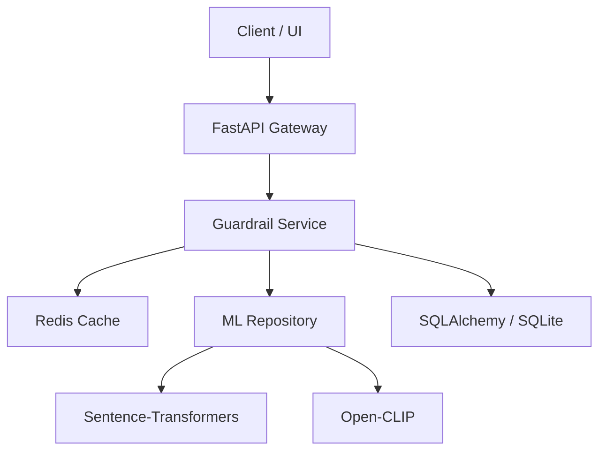

# Architecture & Technical Documentation

This document provides a deep dive into the technical implementation of the **Imagery Guardrail Service**.

## 1. System Architecture

The system is designed as a modular microservice following Clean Architecture principles.

### Components:
- **FastAPI Gateway**: Handles HTTP requests, validation, and routing.
- **Guardrail Service**: The core orchestrator that coordinates text and image validation.
- **ML Repository**: Manages model loading (lazy loading) and inference.
- **Cache Repository**: Handles SHA-256 hashing of inputs and Redis interaction.
- **Log Repository**: Persists every decision for future analysis and training.

## 2. Validation Logic

### Text Validation
- **Injection Detection**: Uses regex patterns to identify common prompt injection attacks (e.g., "ignore previous instructions").
- **Policy Check**: Scans for denylisted terms related to NSFW, violence, and hate speech.
- **Domain Relevance**: Uses `all-MiniLM-L6-v2` to compute cosine similarity between the input prompt and a set of "Food" category embeddings.

### Image Validation
- **CLIP Analysis**: Uses `ViT-B-32` to perform zero-shot classification.
- **NSFW Detection**: Compares image features against an "explicit/nsfw" text label.
- **Food Detection**: Compares image features against a "photo of food" label.

## 3. Performance Optimizations

### Lazy Model Loading
To prevent slow startup times and potential OOM (Out of Memory) errors in containerized environments, models are not loaded during the application's `lifespan` startup. Instead:
1. The service starts instantly.
2. On the first request, the `MLRepository` initializes the models.
3. Models are kept in memory for subsequent requests.

### Result Caching
Every unique combination of `prompt` and `image` is hashed. If a match is found in Redis, the system returns the cached result immediately, bypassing the expensive ML inference step.

## 4. Database Schema

The system uses a simple but effective schema for logging:

- **GuardrailLog**:
  - `id`: Unique identifier.
  - `prompt`: The input text.
  - `status`: PASS or BLOCK.
  - `reasons`: Comma-separated list of violation reasons.
  - `processing_time_ms`: Latency of the request.
  - `created_at`: Timestamp.

## 5. Production Deployment Considerations

- **GPU Acceleration**: While the current setup runs on CPU, the `MLRepository` is designed to automatically use `cuda` if a GPU is available.
- **Scalability**: The service is stateless (aside from the cache/DB), allowing it to be scaled horizontally behind a load balancer.
- **Monitoring**: Logs are formatted for easy ingestion by ELK or Prometheus/Grafana.
